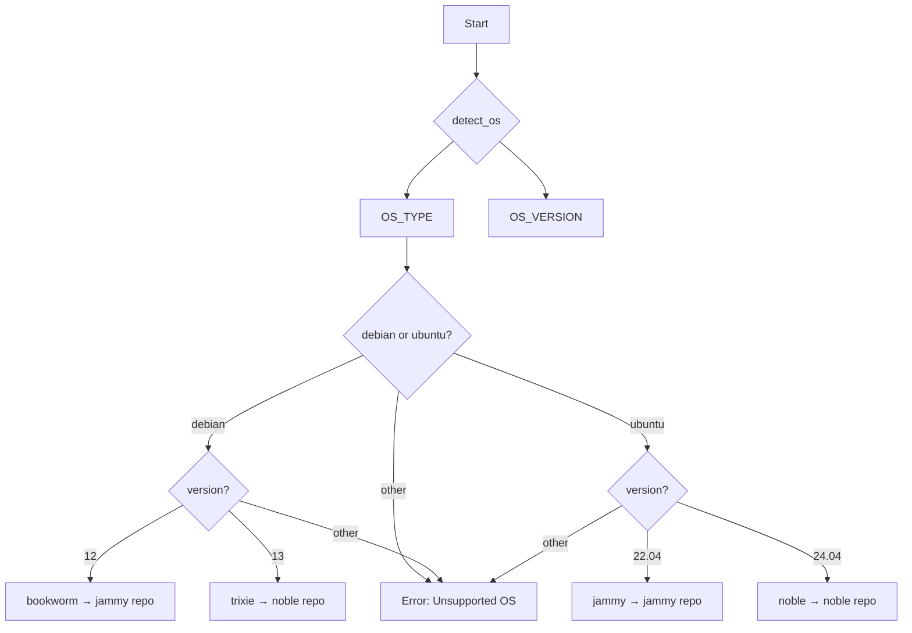

# AMD ROCm Addon Installation Guide

This document explains how to install AMD ROCm (Radeon Open Compute) in Proxmox LXC containers using the Heretek Scripts addon.

---

## Overview

AMD ROCm is a software stack for GPU programming on AMD GPUs. It provides a comprehensive development platform for high-performance computing and machine learning applications.

There are **two ways** to install ROCm:

| Method | Description | Use Case |
|--------|-------------|----------|
| **Standalone Addon** | Interactive script run inside existing container | Adding ROCm to an already-created container |
| **Automatic Installation** | Built-in function during container creation | New containers with GPU passthrough enabled |

---

## Prerequisites

### 1. GPU Passthrough Required

Before running this script, you **must** configure GPU passthrough in your LXC container configuration.

**On the Proxmox Host:**

1. Find the render group GID:
   ```bash
   ls -la /dev/dri/renderD128
   # Note the GID (typically 104 or similar)
   ```

2. Edit the container configuration file:
   ```bash
   nano /etc/pve/lxc/<CTID>.conf
   ```

3. Add GPU device passthrough:
   ```conf
   # For AMD GPUs - add these lines:
   dev0: /dev/kfd,gid=<GID>
   dev1: /dev/dri/renderD128,gid=<GID>
   ```

   Replace `<GID>` with the group ID from step 1 (e.g., `104`).

4. Restart the container:
   ```bash
   pct stop <CTID>
   pct start <CTID>
   ```

### 2. Supported Operating Systems

The ROCm addon supports the following operating systems in LXC containers:

| OS | Version | Codename |
|----|---------|----------|
| Debian | 12 | bookworm |
| Debian | 13 | trixie |
| Ubuntu | 22.04 | jammy |
| Ubuntu | 24.04 | noble |

### 3. Supported AMD GPUs

- AMD Radeon Instinct (MI series)
- AMD Radeon Pro (professional GPUs)
- Some consumer Radeon GPUs (RX 7000 series recommended)

---

## Installation Methods

### Method 1: Standalone Addon Script (Existing Containers)

Execute the script directly inside your LXC container:

```bash
# Enter the container console
pct enter <CTID>

# Run the ROCm addon script
bash -c "$(curl -fsSL https://raw.githubusercontent.com/Heretek-AI/ProxmoxVE/main/tools/addon/rocm.sh)"
```

Or run from the Proxmox host shell:

```bash
# Execute inside a specific container
pct exec <CTID> -- bash -c "$(curl -fsSL https://raw.githubusercontent.com/Heretek-AI/ProxmoxVE/main/tools/addon/rocm.sh)"
```

### Method 2: Automatic Installation (New Containers)

When creating a new container with AMD GPU passthrough enabled, ROCm is installed automatically via the `_setup_rocm()` function in [`misc/tools.func`](misc/tools.func).

**How it works:**

1. During container creation, if you enable GPU passthrough and select **AMD** as the GPU type
2. The build system automatically:
   - Increases disk size by 4GB for ROCm runtime
   - Calls `_setup_rocm()` during the container setup phase
   - Installs ROCm runtime packages (not the full development SDK)

**Enabling GPU Passthrough:**

When running a container creation script, use the advanced settings to enable GPU passthrough:

```bash
# Example: Creating a container with AMD GPU support
bash -c "$(curl -fsSL https://raw.githubusercontent.com/Heretek-AI/ProxmoxVE/main/ct/llamacpp.sh)"
# During setup, select "Yes" for GPU passthrough and choose "AMD"
```

**Code Reference - [`misc/tools.func`](misc/tools.func:4587-4670):**

```bash
# ROCm compute stack (OpenCL + HIP)
_setup_rocm "$os_id" "$os_codename"
```

The `_setup_rocm()` function:
- Detects OS and maps to appropriate ROCm repository
- Adds AMD ROCm and GPU driver repositories
- Installs runtime packages: `rocm-opencl-runtime`, `rocm-hip-runtime`, `rocm-smi-lib`
- Configures environment variables in `/etc/profile.d/rocm.sh`
- Adds user to `render` and `video` groups

**Code Reference - [`misc/build.func`](misc/build.func:3949-3958):**

```bash
# Increase disk size for AMD ROCm runtime (~4GB extra needed)
if [[ "${GPU_TYPE:-}" == "AMD" ]]; then
  local rocm_extra=4
  local new_disk_size=$((PCT_DISK_SIZE + rocm_extra))
  if pct resize "$CTID" rootfs "${new_disk_size}G" >/dev/null 2>&1; then
    msg_ok "Disk resized ${PCT_DISK_SIZE}GB → ${new_disk_size}GB for ROCm"
  fi
fi
```

---

## Interactive Prompts

The script is interactive and will prompt for confirmation:

### Fresh Installation

```
    ____  ____  ________  ___
   / __ \/ __ \/ ____/  |/  /
  / /_/ / / / / /   / /|_/ /
 / _, _/ /_/ / /___/ /  / /
/_/ |_|\____/\____/_/  /_/

ROCM Installer for Proxmox LXC Containers

⚠ ROCm is not installed.

   This will install AMD ROCm on Debian 13
   Supported GPUs: AMD Radeon Instinct, Radeon Pro, and some consumer GPUs

   Install ROCm? (y/N):
```

### Existing Installation

If ROCm is already installed:

```
⚠ ROCm is already installed.

   Uninstall ROCm? (y/N):
   Update ROCm? (y/N):
```

---

## Post-Installation

### 1. Update Environment

After installation, update your PATH:

```bash
# Option 1: Source the environment script
source /etc/profile.d/rocm.sh

# Option 2: Log out and back in
exit
pct enter <CTID>
```

### 2. Verify Installation

```bash
# Check ROCm info
rocminfo

# Check GPU status
rocm-smi
```

### 3. Test GPU Access

```bash
# Verify /dev/kfd is accessible
ls -la /dev/kfd

# Should show something like:
# crw-rw---- 1 root render 235, 0 Mar 12 12:00 /dev/kfd
```

---

## Troubleshooting

### "Unable to open /dev/kfd"

This error indicates GPU passthrough is not configured correctly:

1. Verify the container config has the device entries
2. Check the GID matches your system's render group
3. Ensure the container has been restarted after config changes

### ROCm Commands Not Found

If `rocminfo` or `rocm-smi` commands are not found:

```bash
# Source the environment
source /etc/profile.d/rocm.sh

# Or add to your shell profile
echo 'source /etc/profile.d/rocm.sh' >> ~/.bashrc
```

### Permission Denied on GPU Devices

```bash
# Add your user to render and video groups
usermod -aG render,video <username>

# Log out and back in for changes to take effect
```

---

## Uninstallation

To remove ROCm:

1. Run the script again in a container with ROCm installed
2. When prompted, answer `y` to "Uninstall ROCm?"

Or manually:

```bash
apt remove -y rocm
apt autoremove -y
rm -f /etc/apt/sources.list.d/rocm.sources
rm -f /etc/apt/keyrings/rocm.gpg
rm -f /etc/apt/preferences.d/rocm-pin-600
rm -f /etc/profile.d/rocm.sh
```

---

## Updating

To update ROCm to the latest version:

1. Run the script in a container with ROCm installed
2. When prompted, answer `y` to "Update ROCm?"

---

## Technical Details

### Installed Components

| Component | Location |
|-----------|----------|
| ROCm binaries | `/opt/rocm/bin/` |
| ROCm libraries | `/opt/rocm/lib/` |
| Environment script | `/etc/profile.d/rocm.sh` |
| GPG key | `/etc/apt/keyrings/rocm.gpg` |
| APT sources | `/etc/apt/sources.list.d/rocm.sources` |
| Package preferences | `/etc/apt/preferences.d/rocm-pin-600` |

### ROCm Version

The script installs **ROCm 7.2** by default. This version provides:
- HIP runtime
- ROCm libraries
- Development tools
- GPU management utilities

### OS Detection and Repository Mapping

Both the standalone addon and automatic installation use the same OS detection and repository mapping logic to ensure compatibility.

#### OS Detection Flow



#### Repository Mapping Logic

The ROCm repositories use Ubuntu-based package naming, so Debian systems must map to compatible Ubuntu codenames:

| Host OS | OS Codename | ROCm Repo Codename | Reason |
|---------|-------------|-------------------|--------|
| Debian 12 | bookworm | jammy | Ubuntu 22.04 LTS base |
| Debian 13 | trixie | noble | Ubuntu 24.04 LTS base |
| Ubuntu 22.04 | jammy | jammy | Native support |
| Ubuntu 24.04 | noble | noble | Native support |

**Code Reference - [`tools/addon/rocm.sh`](tools/addon/rocm.sh:48-96):**

```bash
function setup_rocm_repo_mapping() {
  ROCM_VERSION="7.2"

  case "${OS_TYPE}" in
    debian)
      OS="Debian"
      case "${OS_VERSION}" in
        12)
          OS_CODENAME="bookworm"
          ROCM_REPO_CODENAME="jammy"  # Maps to Ubuntu 22.04
          ;;
        13)
          OS_CODENAME="trixie"
          ROCM_REPO_CODENAME="noble"  # Maps to Ubuntu 24.04
          ;;
        *)
          msg_error "Unsupported Debian version: ${OS_VERSION}"
          exit 1
          ;;
      esac
      ;;
    ubuntu)
      OS="Ubuntu"
      case "${OS_VERSION}" in
        22.04)
          OS_CODENAME="jammy"
          ROCM_REPO_CODENAME="jammy"  # Native
          ;;
        24.04)
          OS_CODENAME="noble"
          ROCM_REPO_CODENAME="noble"  # Native
          ;;
        *)
          msg_error "Unsupported Ubuntu version: ${OS_VERSION}"
          exit 1
          ;;
      esac
      ;;
    *)
      msg_error "Unsupported OS: ${OS_TYPE}"
      exit 1
      ;;
  esac
}
```

#### Architecture Check

ROCm is only available for **amd64 (x86_64)** architecture. The automatic installation includes an architecture check:

**Code Reference - [`misc/tools.func`](misc/tools.func:4591-4594):**

```bash
# Only amd64 is supported
if [[ "$(dpkg --print-architecture 2>/dev/null)" != "amd64" ]]; then
  msg_warn "ROCm is only available for amd64 — skipping"
  return 0
fi
```

#### Repository Configuration

Both methods configure two APT repositories:

1. **ROCm Main Repository** - Core ROCm packages
   - URL: `https://repo.radeon.com/rocm/apt/7.2`
   - Components: `main`

2. **AMDGPU Driver Repository** - GPU driver components
   - URL: `https://repo.radeon.com/amdgpu/latest/ubuntu`
   - Components: `main`

**Repository File Structure** (`/etc/apt/sources.list.d/rocm.sources`):

```
Types: deb
URIs: https://repo.radeon.com/rocm/apt/7.2
Suites: noble
Components: main
Architectures: amd64
Signed-By: /etc/apt/keyrings/rocm.gpg

Types: deb
URIs: https://repo.radeon.com/amdgpu/latest/ubuntu
Suites: noble
Components: main
Architectures: amd64
Signed-By: /etc/apt/keyrings/rocm.gpg
```

#### Package Pinning

Both methods configure APT pinning to prioritize ROCm packages:

**File:** `/etc/apt/preferences.d/rocm-pin-600`

```
Package: *
Pin: release o=repo.radeon.com
Pin-Priority: 600
```

This ensures ROCm packages from the Radeon repository take precedence over any conflicting packages from the distribution's default repositories.

---

## Comparison: Standalone vs Automatic Installation

| Feature | Standalone Addon | Automatic Installation |
|---------|-----------------|------------------------|
| **When to use** | Existing containers | New container creation |
| **Disk resize** | Manual (if needed) | Automatic (+4GB) |
| **Packages installed** | Full `rocm` meta-package | Runtime only (smaller) |
| **Interactive** | Yes (prompts for confirmation) | No (automatic) |
| **Uninstall option** | Yes (interactive) | Manual removal only |
| **Update option** | Yes (interactive) | Manual update required |
| **GPU detection** | Warns if `/dev/kfd` missing | Assumes GPU configured |

### Package Differences

**Standalone Addon** ([`tools/addon/rocm.sh`](tools/addon/rocm.sh)):
```bash
apt install -y rocm  # Full meta-package (~15GB+ with dev tools)
```

**Automatic Installation** ([`misc/tools.func`](misc/tools.func:4644-4648)):
```bash
apt install -y rocm-opencl-runtime rocm-hip-runtime rocm-smi-lib
# Runtime packages only (smaller footprint)
```

If you need development tools after using automatic installation:

```bash
# Install full ROCm development stack
apt install -y rocm-dev
```

---

## Related Scripts

- **llama.cpp Server** - Uses ROCm for GPU-accelerated LLM inference
- **SwarmUI** - Uses ROCm for Stable Diffusion image generation
- **Lemonade** - Uses ROCm for local LLM inference

---

## Additional Resources

- [AMD ROCm Documentation](https://rocm.docs.amd.com/)
- [AMD GPU Passthrough Guide](https://rocm.docs.amd.com/en/latest/how-to/gpu-isolation.html)
- [Proxmox GPU Passthrough](https://pve.proxmox.com/wiki/Passthrough_Physical_Disk_to_Virtual_Machine)
